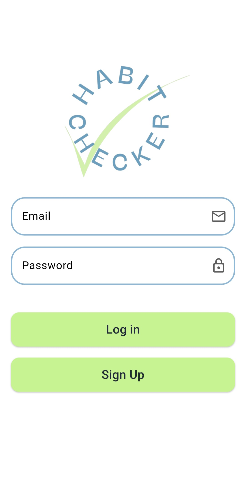
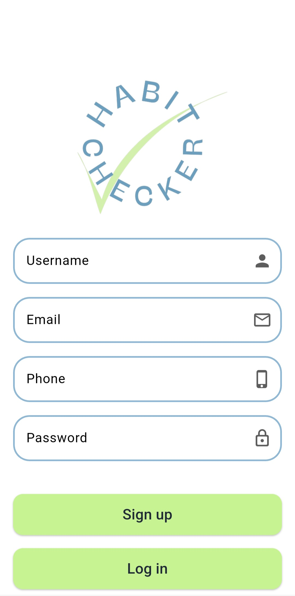
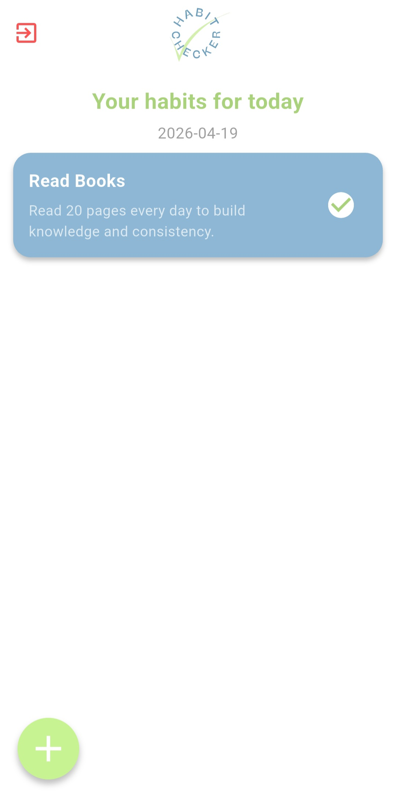
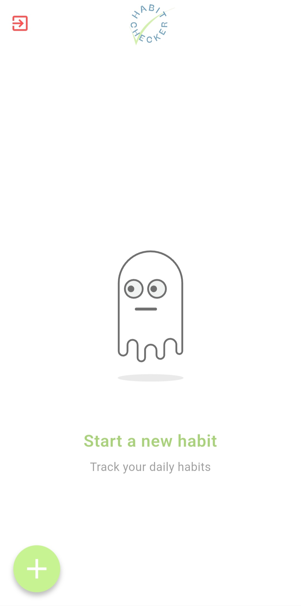
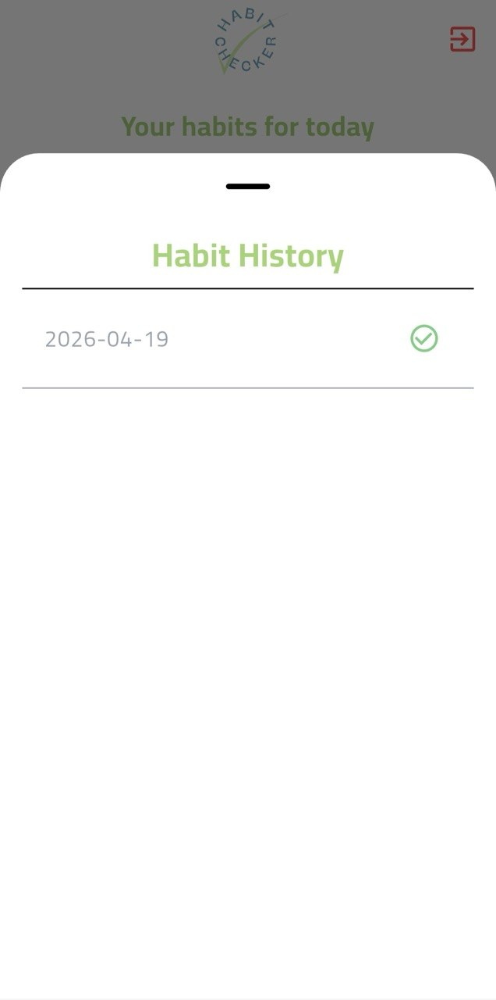

# Habit Checker ✅

Habit Checker is a Flutter application designed to help users build and track daily habits.  
The app allows users to create habits and mark daily completion using a clean and simple interface.

---

## 📖 Project Overview 

Project Name: Habit Checker

This app provides:

- 🔐 User Authentication (Login & Sign Up)
- 📝 Habit Management (Add & Delete habits)
- ✅ Daily Habit Tracking (Mark habits as completed)
- 📊 Progress Logging using Supabase database
- 🔗 Real-time data synced per user account

The app ensures each user has their own personalized habit tracker with secure authentication.

---

## 📱 App Flow

1. User opens the app
2. Signs up or logs in
3. Lands on Habits Screen
4. Adds a new habit (e.g. Drink water, Read, Walk)
5. Marks habit as completed daily using checkbox
6. Data is stored and synced with Supabase

---

## 🧠 Features

- 🔐 Email & Password Authentication (Supabase Auth)
- 📝 Add new habits dynamically
- 🗑 Delete habits
- ✅ Daily completion tracking per habit
- 📊 Habit logs stored in database
- 🔄 Real-time data updates per user
- 📅 Habit History: tap a habit to view full daily logs (completed / not completed) for today and past dates
- 🧩 Clean Architecture (Data / Domain / Presentation)
- ⚡ State Management using Cubit

---

## 🗄 Database Structure (Supabase)

### 👤 profiles
- id (UUID, PK, FK → auth.users.id)
- username (Text)
- created_at (Timestamp)

---

### 📝 habits
- id (UUID, Primary Key)
- title (Text)
- user_id (UUID, FK → auth.users.id)
- created_at (Timestamp)

---

### 📊 habit_logs
- id (UUID, Primary Key)
- habit_id (UUID, FK → habits.id)
- log_date (Date)
- is_completed (Boolean, default: false)

---

## 📸 Screenshots

| Login | Sign Up | Habits Screen |
|---|---|---|
|  |  |  |

| Add Habit | Habit History | Empty State |
|---|---|---|
|  |  |  |

---

## 🎬 Demo Video

Quick overview of Plantify AI functionality:

https://github.com/user-attachments/assets/9c5cd0d1-97b7-4130-bca0-b26325cc93b8

---

## 📦 Packages Used

- flutter_bloc
- supabase_flutter
- get_it
- injectable
- equatable
- json_annotation
- freezed
- dio
- go_router
- any_image_view
- uuid
- lottie
- flutter_launcher_icons

---

## ⚙️ Setup & Installation

1. Clone the repository: `git clone https://github.com/flutter-gg-2026/personal-habit-tracker-app-m_group.git`
2. Install dependencies: `flutter pub get`
3. Run the app: `flutter run`
